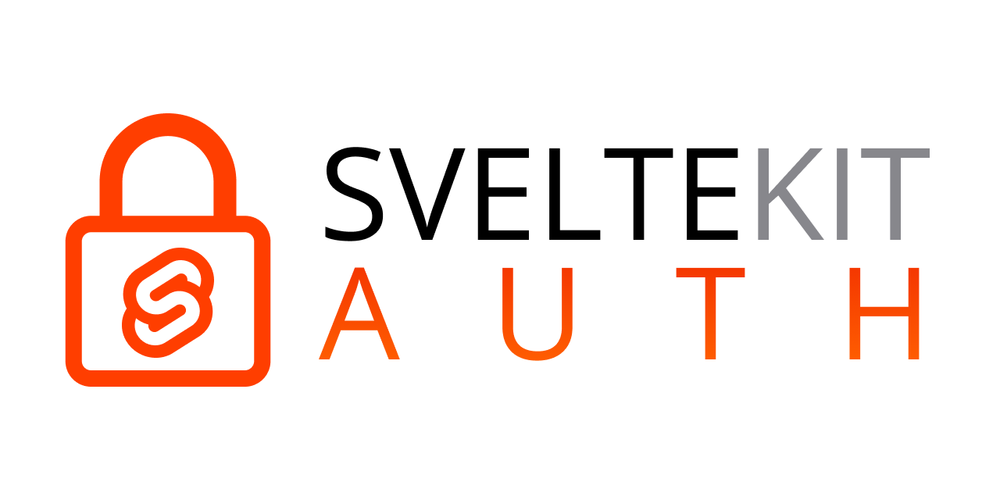

# SvelteKitAuth


[](https://www.npmjs.com/package/sk-auth)
[](https://www.npmjs.com/package/sk-auth)
[](https://www.npmjs.com/package/sk-auth)

Authentication library for use with SvelteKit featuring built-in OAuth providers and zero restriction customization!

## Getting Started

SvelteKitAuth is very easy to setup! All you need to do is instantiate the `SvelteKitAuth` class, and configure it with some default providers:

```ts
export const appAuth = new SvelteKitAuth({
  providers: [
    new GoogleOAuthProvider({
      clientId: import.meta.env.VITE_GOOGLE_OAUTH_CLIENT_ID,
      clientSecret: import.meta.env.VITE_GOOGLE_OAUTH_CLIENT_SECRET,
      profile(profile) {
        return { ...profile, provider: "google" };
      },
    }),
  ],
  callbacks: {
    jwt(token, profile) {
      if (profile?.provider) {
        const { provider, ...account } = profile;
        token = {
          ...token,
          user: {
            ...token.user,
            connections: { [provider]: account },
          },
        };
      }

      return token;
    },
  },
  jwtSecret: import.meta.env.JWT_SECRET_KEY,
});
```

If you want to augment the default SvelteKit session to get access to the user in the `session` store, you can use the `getSession` hook:

```ts
// overriding the default session
export const { getSession } = appAuth;

// augmenting it
export const getSession: GetSession = async (request) => {
  const { user } = await appAuth.getSession(request);

  return { user };
};
```

## Adding more Providers

SvelteKitAuth uses a object-oriented approach towards creating providers. It is unopionated and allows you to implement any three-legged authentication flow such as OAuth, SAML SSO, and even regular credential logins by omitting the `signin()` route.

You can implement your own using the `Provider` base provider class, and by implementing the `signin()` and `callback()` methods:

```ts
export abstract class Provider<T extends ProviderConfig = ProviderConfig> {
  abstract signin<Locals extends Record<string, any> = Record<string, any>, Body = unknown>(
    request: ServerRequest<Locals, Body>,
  ): EndpointOutput | Promise<EndpointOutput>;

  abstract callback<Locals extends Record<string, any> = Record<string, any>, Body = unknown>(
    request: ServerRequest<Locals, Body>,
  ): CallbackResult | Promise<CallbackResult>;
}
```

`signin()` must return a generic endpoint output, this can be a redirect, or the path to the provider's sign-in page. When implementing a `HTTP POST` route, `signin()` can simply return an empty body and `callback()` should handle the user login flow.

`callback()` takes a `ServerRequest` and must return a `CallbackResult` which is a custom type exported by `svelte-kit-auth`:

```ts
export type Profile = any;
export type CallbackResult = [Profile, string | null];
```

The first item in the tuple is the user profile, which gets stored in the token, and is provided to the `jwt()` callback as the second argument. The second item is a redirect route, which may be tracked using the `state` query parameter for OAuth providers, or other implementations depending on the sign-in method.

## Motivation

SvelteKitAuth is inspired by the [NextAuth.js](https://next-auth.js.org/) package built for the Next.js SSR framework for React. Unlike NextAuth.js, though, it is completely unopinionated and only provides implementations for default flows, while still enabling users to add their own providers.

As it leverages classes and Typescript, the implementation of such providers is very straightforward, and in the future it will even be possible to register multiple SvelteKitAuth handlers in the same project, should the need arise, by leveraging a class-based client and server setup.

## Contributing

🚧 Work in Progress!

## License

This project is licensed under the terms of the MIT license.
